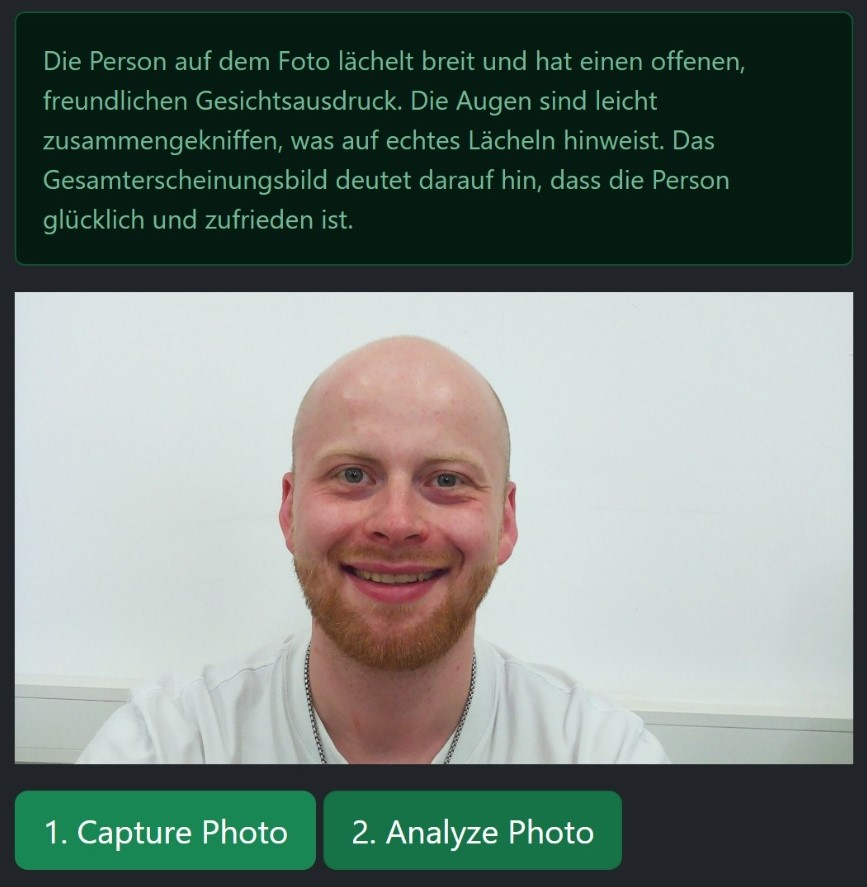
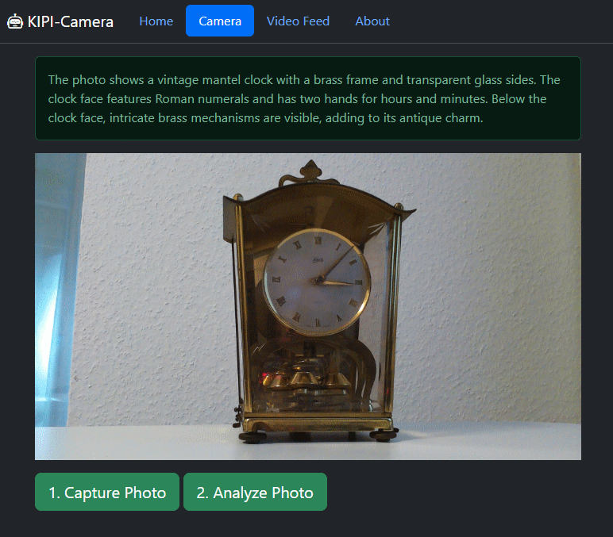
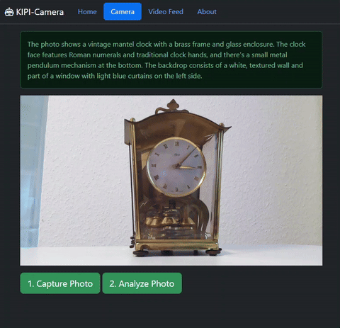
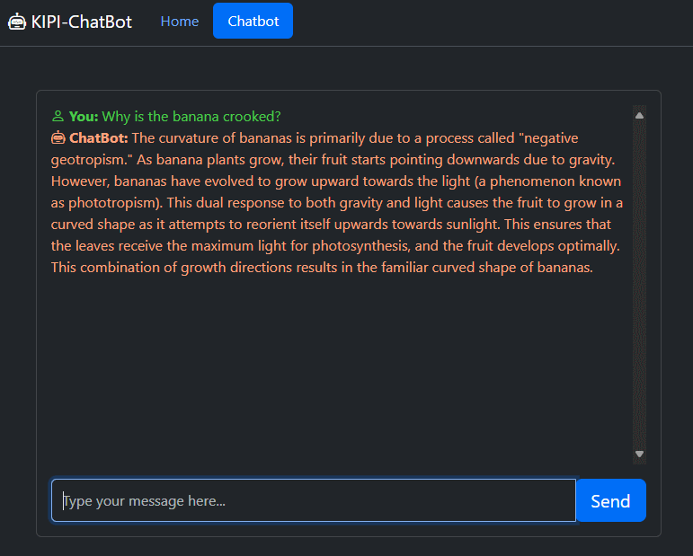
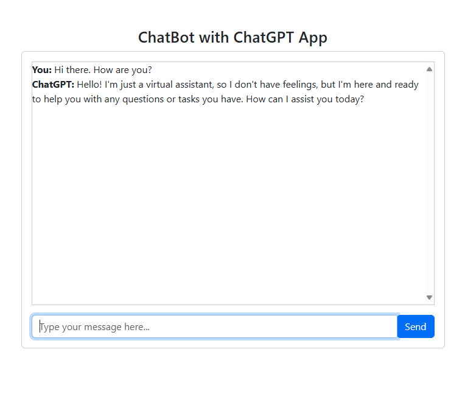
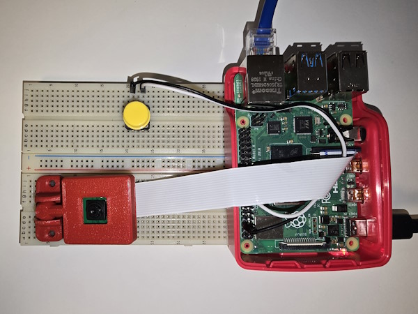
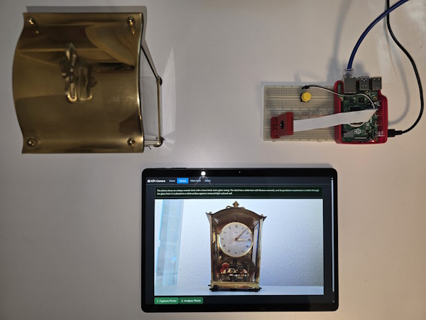
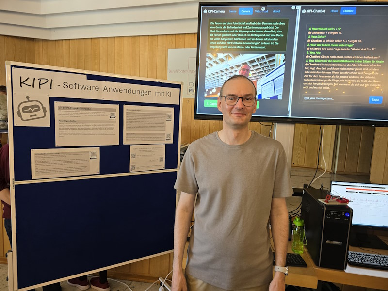
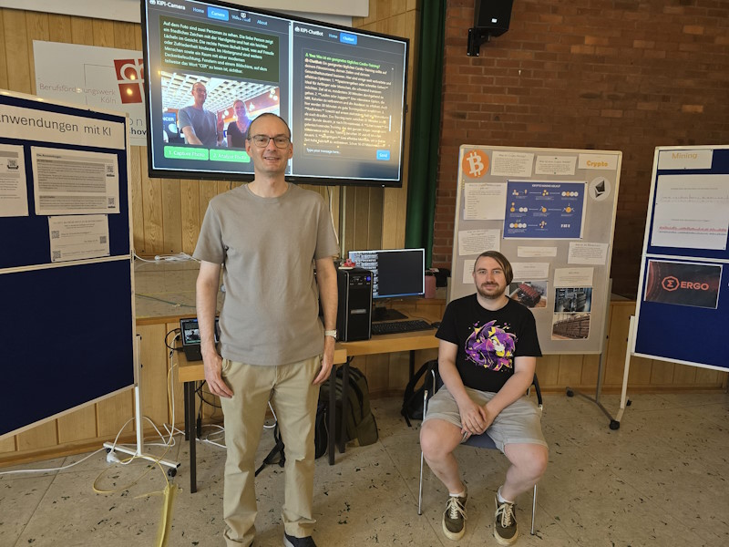

# kipi-docs
Die Dokumentation zum KIPI Projekt. Das Projekt war Teil des RV-Lehrgangs am Berufsförderungswerk in Köln im Zeitraum vom 27.03.2024 bis 25.06.2024.

KIPI ist ein Softwareentwicklungsprojekt, dessen Softwareanwendungen von künstlicher Intelligenz unterstützt werden. 

## KIPI-Projektübersicht
KIPI ist ein Softwareentwicklungsprojekt, bestehend aus zwei Computerprogrammen, dessen Softwareanwendungen von künstlicher Intelligenz unterstützt werden. Bei diesen Computerprogrammen handelt es sich um zwei Webanwendungen die auf dem Mini-Computer "Raspberry Pi“ mit angeschlossener Kamera lauffähig sind.

## Projektgeschichte
Während der Projektzeit wurde sich mit den KI-Programmierwerkzeugen von OpenAI beschäftigt (bekannt durch ChatGPT). Durch Experimentieren mit Bild- und Fotoerkennung sind Ideen für eigene Anwendungen entstanden, die sich die KI von OpenAI Vision für die Bilderkennung zu Hilfe nehmen. Parallel sind eigene Software-Prototypen mit dem Mini-Computer „Raspberry Pi“ samt Kamera entstanden. In einem weiteren Schritt kam die Webanwendungsentwicklung hinzu, die es schließlich ermöglichte eigene Programme zu erstellen, welche auch für den Anwender benutzbar sind.

Im technischen Detail bedeutet dies, dass die Webanwendungen mehrere Anwendungsprogrammierschnittstellen (APIs) ansprechen. Damit lässt sich aus mehreren Softwareanwendungen und -komponenten ein Anwenderprogramm erstellen.
 
## Die Anwendungen

###  [KIPI Camera](https://github.com/hascheel/kipi-camera)
KIPI Camera ist eine Fotoaufnahme- und Foto-Analyse-Software, die den Inhalt von Fotos beschreiben kann. Es können ein oder mehrere Personen samt Mimik, Gestik und Gefühlslage beschrieben werden. Sind Gegenstände oder Umgebungen auf dem Foto vorhanden werden diese ebenfalls in die Beschreibung mit angegeben.
Der Minicomputer "Raspberry Pi“ nimmt mit seiner Kamera ein Foto auf. Anschließend wird dieses Foto mit Hilfe einer KI von OpenAI Vision auf Inhalte geprüft und eine Textbeschreibung des Fotos ausgegeben.
Eine zusätzliche Herausforderung aus Entwicklersicht ist, die Aufgabenstellung (Prompting) an die KI so zu verfassen, dass alles Relevante auf einem Foto erkannt wird und anschließend in einem sehr kurzen Text wiedergegeben wird.

Die Software ist verfügbar auf GitHub.com: https://github.com/hascheel/kipi-camera

  

###  [KIPI ChatBot](https://github.com/hascheel/kipi-chatbot)
KIPI ChatBot ist eine ChatBot-Software für Wissensanfragen und Unterhaltungen mit einer KI. Die Webanwendung macht eine Chat-Unterhaltung in Echtzeit möglich. Der KIPI-ChatBot kann eine längere Unterhaltung führen und behält das Gesprächsthema (den Kontext) stehts bei.

Die Software ist verfügbar auf GitHub.com: https://github.com/hascheel/kipi-chatbot

###  [ChatBot Programmier-Tutorial](https://github.com/hascheel/kipi-chatbot-tutorial)
Mit Hilfe dieser Anleitung (Tutorial) kannst du einen ChatBot selbst programmieren. Diese ChatBot-Software erhält KI-Unterstützung durch OpenAI GPT 4o.

Vorrausetzungen:
Es wird für das Betreiben des eigenen ChatBots ein kostenfreies Entwickler-Benutzerkonto von OpenAI benötigt. Lädt man dieses Benutzerkonto nun einmalig mit 5 € Guthaben auf, lassen sich die modernsten KI-Werkzeuge von OpenAI ohne Beschränkungen nutzen. Ein OpenAI Entwicklerkonto ist somit zurzeit eine günstigere Alternative zu einem "ChatGPT Plus" Abo für 20 € im Monat. (Stand: Juni 2024)

Tipp:
Es lassen sich mit diesem OpenAI Entwicklerkonto diverse Programme von OpenAI im "Playground“ ohne Programmierkenntnisse nutzen. Neben einem 'unbeschränkten' und 'anpassbaren' ChatGPT Chatbot sind auch diverse Werkzeuge zur Datenanalyse und Datenaufbereitung verfügbar.

Das Tutorial ist verfügbar auf: https://github.com/hascheel/kipi-chatbot-tutorial

## Projektverlauf
Die Projektidee vorab war KI unterstützte Softwareprogramme zu entwickeln. Im ersten Schritt soll sich mit Künstlicher Intelligenz im Groben auseinandergesetzt werden. Um dann einige Arten von KI auszuwählen, die in einem Softwareprogramm Verwendung finden können. Im Vorfeld wurde schon ungefähr bestimmt um welche Software es sich handeln könnte. Zum Beispiel um einen Chatbot und einer Bild-/ Fotobeschreibungssoftware.

Was wurde im Projekt gemacht?
- Machbarkeitsstudien wurden durchgeführt und Prototypen entwickelt. Im Detail handelt es sich um:
    - Fotosoftware die eine Textbeschreibung des Fotos ausgibt.
    - Chatbot-Software mit der der Benutzer per Texteingabe eine Unterhaltung führt.
- Hardware ausgewählt und besorgt, die für die Fotoerstellung benötigt wird und worauf die Software lauffähig sein soll.
    - Raspberry Pi 4 mit Kamera (dient auch als Server)
    - Eigenes unabhängiges Netzwerk mit Internetanbindung:
        - 1x WLAN-Bridge als Client / AP Client
        - 1x WLAN-Router mit NAT und Switch
        - Netzwerkkabel
- Der Raspberry Pi 4 samt Kamera wurde konfiguriert und für die spätere Implementierung vorbereitet.
- Das eigene Netzwerk wurde konfiguriert, sodass es täglich auf- und abgebaut werden kann.
- Ein Webapplikationsframework ‚FLASK‘ wurde auserwählt, welches dabei unterstützt die beiden Softwareprogramme (Chatbot und Fotosoftware) auf Client-Server Basis zu programmieren bzw. zu implementieren.
- Vier Wochen wurden benötigt, um sich in die neuen Technologien einzuarbeiten. Das sind u. a. die Programmiersprachen Python, JavaScript, CSS und HTML. Das Framework ‚FLASK‘. Und das Entwickeln mit der Foto-Hardware (Raspberry Pi) wurde erlernt.
- Die beiden ausgewählten Software-Prototypen (Chatbot und Fotobeschreibungssoftware) wurden in eine Webapplikation implementiert.

## Projektvorstellung am 24.06.2024
Für den Tag der Projektvorstellung als kleiner Messestand wurde folgendes Material benötigt:
- 1x mobile Pin- oder Trennwand, um eine Projekt-Dokumentation anzubringen.
- 1x Tisch, worauf sämtliche Hardware aufgebaut wird.
- 1x Smartboard (großer rollbarer Bildschirm mit Touch-Bedienung), das als Präsentationsbildschirm dient.
- Stromverlängerungskabel bis zum Tisch.
- Mehrfachstromsteckdose für alle Geräte.

 
